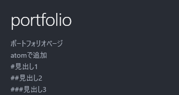

# portfolio
ポートフォリオページ<br>atomで追加
<br>#見出し1
<br>##見出し2
<br>###見出し3
<br>##書式
<br>**太字** **bold**
<br>*斜体* *Italic*
<br>~~打消し線~~ ~~Strikethrough~~
<br>## コードブロック
<br>これは`code block within a line`です。
```cs
string a = "これはC#(cs)初期のブロック";
```
##リンク
<br>[unityroom inoue](https://unityroom.com/users/qi34y7cp8ukgfvxejmsz)

##画像
<br>


## 箇条書き

### 通常リスト
- 箇条書き1
- 箇条書き2
- 箇条書き3

### 通し番号付きリスト
1. 通し番号1
1. 通し番号2
1. 通し番号3

### 途中から番号を始める

100. 好きな値から
100. 始められる


### 字下げ
- 箇条書き
 - 字下げ
  - 字下げ

## タスクリスト
- [ ] タスク1
- [ ] タスク2
- [x] タスク3

## 段落
1行だけの改行は
効果がない。

空行を1行入れる。

## セパレーター

---

---


### 補足
補足[^1]の表記。
[^1]: 補足をページ末に記載

## 表
|表の|書式|
|:-:|:-|
|これを|知っていると|
|表現の幅が広がって|便利。|
