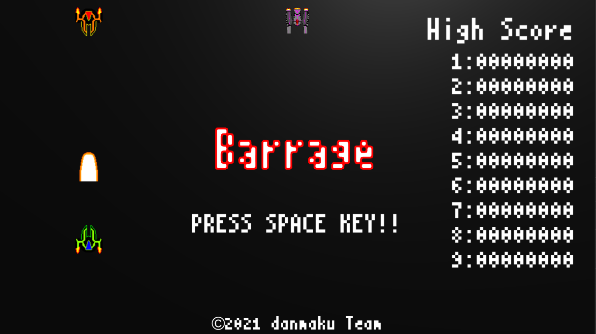
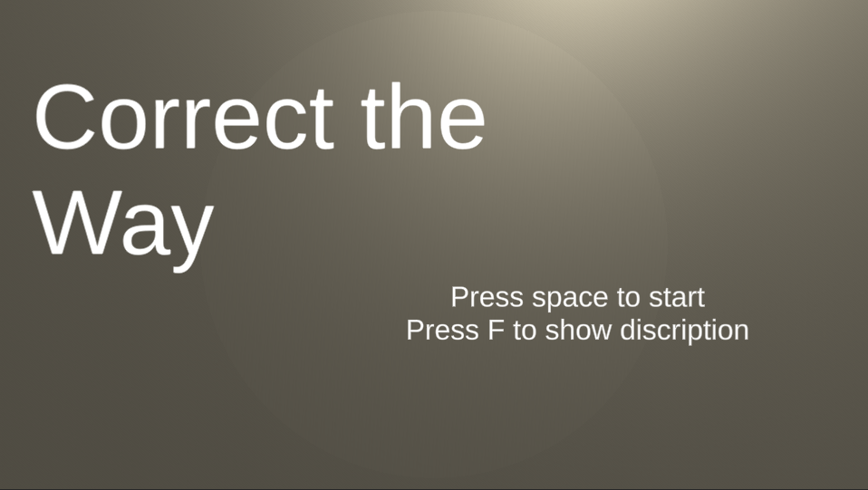

**# portfolio**

## 井上悠
 - デジタルアーツ東京 ゲーム学科プログラミングコース 2023年卒業予定

### スキル
- C/C++
 - 利用歴約4年
 - C/C++をベースとしたarduinoでデジタル時計を制作
- Unity
 - 利用歴1年
- C#
 - 利用歴1年

### 取り組んでいるテーマ
 - Unityを主としたゲーム制作技術の向上

### 成果物
---
 # よけとる-endless-
 

リンク: [よけとる-endless-](https://unityroom.com/games/yoketoruendless)

---
 # Barrage
 

---
# Correct the way

- 製作期間約2週間

---
#### 連絡先
 - [gmailアドレス](mailto:yuuyuu7001@gmail.com)
